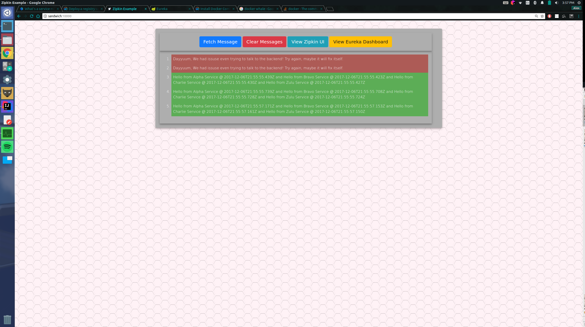
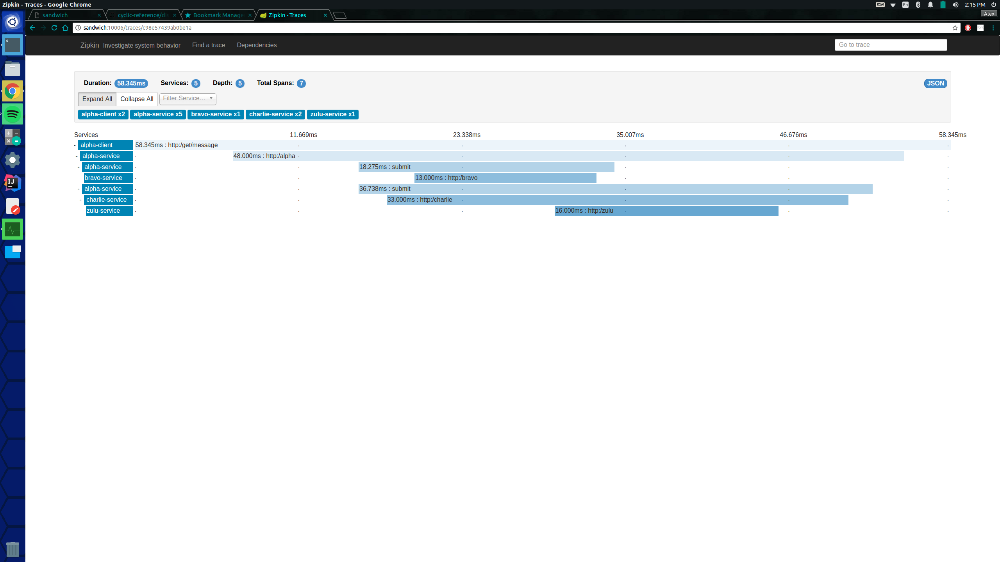
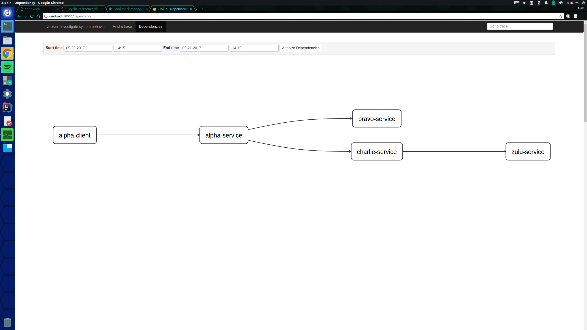

# Distributed Tracing

This project demonstrates the capabilities of Zipkin's ability to tracing distributed Systems,  having requests go further than the initial server initially queried.
Meaning that dependencies exist on several, distributed, servers.

### Prerequisites

To run the sample you will need:
 - Internet Connection (At least the first time it is run)
 - [Docker 17.09.0](https://www.docker.com/) 
 - [Docker-Compose 1.12.0](https://docs.docker.com/compose/install/)
 - About 3 gb of free ram

 
For those who do not want easy mode, please have these on your box.
 - [Java 8 runtime](http://blog.acari.io/jvm/2017/05/05/Gradle-Install.html)
 - [Gradle 2.3+ ](http://blog.acari.io/jvm/2017/05/05/Gradle-Install.html)
 - [RabbitMQ](https://www.rabbitmq.com/download.html), alternatively through a [Docker Image](https://hub.docker.com/_/rabbitmq/) running on port 5672
 - Whole lot of ram like 8gb, or you could run every jar with java options of `-Xmx512M -XX:MaxPermSize=384M`
 
For a more smaller, less memory intensive, and less cool example please visit [https://github.com/cyclic-reference/simple-zipkin](https://github.com/cyclic-reference/simple-zipkin)

The following code base contains seven runnable web application servers.

#### Zipkin

The first server is located in the "zipkin-server" directory.
Which should come to no surprise, contains a Spring Zipkin Stream Server.
Allowing other applications running Spring Cloud Sleuth Stream, to send its Span information to this server.
Provided correct configurations and an available RabbitMQ server.
The Zipkin server will run on a different port than the well known default port.
In this repository, the server will be running on port 80 but will be mapped to the host port of 7865.

#### Eureka

The second server resides in the "eureka-server" directory.
This is, well a Eureka server.
Which is a [Netflix OSS](https://netflix.github.io/) (Open Source Software) Service Discovery server.
In short Service Discovery allows services to register themselves to Eureka to be... well discovered.
Let's say that we have two instances of Alpha Service deployed on separate boxes.
Both of the services can register themselves on a Eureka cluster. 
So when a client comes along and wants to use an instance of Alpha Service, then all it has to do is go to the Eureka cluster.
Eurka will provide the client with an Alpha Service, provided at least one or more Alpha service is registered.
Allowing Alpha Services to come and go as they please, without having the clients having to know about it.
In this repository, the server will be running on port 80 but will be mapped to the host port of 10001.

#### Alpha Client

Next, is a web server located in the "alpha-client" directory.
This is Spring Boot application.
It should probably be obvious that this will be consuming a Alpha Service (which will be discussed next).
The application exposes a HTTP GET REST api on port 10000.
This is the following resource:

    http://localhost:10000/get/message
    
This application and all of servers yet to be mention have the following dependencies:

- Feign Client
- Eureka Discovery (needed for feign client to work)
- Sleuth Stream (needed to send spans to zipkin) 
- Stream Rabbit (needed because I asked for RabbitMQ as message delivery)

#### Alpha Service

As promised, the Alpha Service is located in the "alpha-service" directory.
Alpha service has a dependency on both Bravo and Charlie Service.
It exposed an HTTP GET REST, which will be available to any containers running in its network.
This is the following resource:
    
    http://alpha-service/alpha

#### Bravo Service

Next, is the Bravo Service is located in the "bravo-service" directory (starting to see a pattern?).
Bravo service has no dependencies on any other services.
It exposed an HTTP GET REST, which will be available to any containers running in its network.
This is the following resource:
    
    http://bravo-service/bravo

#### Charlie Service

After that, there is the Charlie Service in the "charlie-service" directory.
Charlie Service has a dependency on Zulu Service.
It exposed an HTTP GET REST api on port 10004.
This is the following resource:
    
    http://charlie-service/charlie

#### Zulu Service

Lastly we end with Zulu Service, which is-wait for it-in the "zulu-service" directory.
_Big surprise!!_
Much like Bravo Service, it has no external dependencies.
It exposed an HTTP GET REST, which will be available to any containers running in its network.
This is the following resource:
    
    http://zulu-service/zulu

#### Running the Cluster

To the entire project:
1. Open a command line with the root of this repository as the present working directory.
1. Run `docker-compose up -d`

This will start the following containers

1. RabbitMQ
1. Zipkin
1. Eureka
1. Alpha Client
1. Alpha Service
1. Bravo Service
1. Charlie Service
1. Zulu Service

Once all of the servers are running, start a web browser.
Put the following in your address bar and run: 

    http://localhost:10000/
    
You should now see the simple user interface for the Alpha Client.
    
Alternatively you could run this curl command:

    curl -i localhost:10000/get/message
    
You might get a error message once or twice.
This is [Hystrix](https://github.com/Netflix/Hystrix) in action, timing out the Feign client request.
I assume that when the first request come in, the application was not warmed up.
Whatever it may be, it is too slow for the default configuration for Hystrix.

It may take a couple tries so

This should output something like this to the browser window
    

You should now be able to access the Zipkin UI, and have at least one trace, in a browser window as well at `http://localhost:7865/`

Provided that the "End Time" parameter of the trace query is at or after the time you made your browser requests, you should get something that looks like this!

It should also give a neat directed dependency graph!

Enjoy!

-Alex